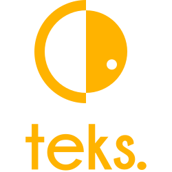

# tEKS

<p align="center">
  
</p>

[](https://github.com/particuleio/teks/actions/workflows/terraform.yml)
[](https://github.com/particuleio/teks/actions/workflows/mkdocs.yml)
[](https://github.com/semantic-release/semantic-release)
[](https://app.fossa.com/projects/git%2Bgithub.com%2Fparticuleio%2Fteks?ref=badge_shield)

<!-- vim-markdown-toc GFM -->

* [Terraform/Terragrunt](#terraformterragrunt)
* [Contributing](#contributing)
* [Requirements](#requirements)
  * [Terragrunt](#terragrunt)
* [Quickstart](#quickstart)
* [Main purposes](#main-purposes)
* [What you get](#what-you-get)
* [Curated Features](#curated-features)
  * [Bottlerocket support](#bottlerocket-support)
  * [AWS Session Manager by default](#aws-session-manager-by-default)
  * [From and to Zero scaling with EKS Managed Node Groups](#from-and-to-zero-scaling-with-eks-managed-node-groups)
  * [Automatic dependencies upgrade](#automatic-dependencies-upgrade)
  * [Enforced security](#enforced-security)
  * [Out of the box logging](#out-of-the-box-logging)
  * [Out of the box monitoring](#out-of-the-box-monitoring)
  * [Long term storage with Thanos](#long-term-storage-with-thanos)
  * [Support for ARM instances](#support-for-arm-instances)
  * [Helm v3 provider](#helm-v3-provider)
  * [Other and not limited to](#other-and-not-limited-to)
  * [Always up to date](#always-up-to-date)
* [Requirements](#requirements-1)
  * [Pre-commit](#pre-commit)
  * [ASDF](#asdf)
    * [Enabling plugins](#enabling-plugins)
    * [Installing tools](#installing-tools)
* [Examples](#examples)
* [Additional infrastructure blocks](#additional-infrastructure-blocks)
* [Branches](#branches)
* [License](#license)

<!-- vim-markdown-toc -->

tEKS is a set of Terraform / Terragrunt modules designed to get you everything
you need to run a production EKS cluster on AWS. It ships with sensible
defaults, and add a lot of common addons with their configurations that work out
of the box.

This is our opinionated view of what a well structred infrastructure as code
repository should look like.

:warning: the v5 and further version of this project have been completely revamp
and now offer a skeleton to use as a base for your infrastructure projects
around EKS. All the modules have been moved outside this repository and get
their own versioning. The [old README is accessible
here](https://github.com/particuleio/teks/tree/release-4.X)

:warning: Terraform implementation will not be maintained anymore because of
time, and mostly because it has become quite difficult to get feature parity
with Terragrunt. [Archive branch is available here](https://github.com/particuleio/teks/tree/archive/terraform)

## Terraform/Terragrunt

* Terragrunt implementation is available in the [`terragrunt`](./terragrunt) folder.

## Contributing

Contribution are welcome, as well as issues, we are usually quite reactive. If
you need more support for your project, do not hesitate to [reach us
directly](mailto:contact@particule.io).

## Requirements

### Terragrunt

* [Terraform](https://www.terraform.io/downloads.html)
* [Terragrunt](https://github.com/gruntwork-io/terragrunt/releases)

## Quickstart

Quickstart guide is available [here](./QUICKSTART.md) or on the [official
documentation website](https://particuleio.github.io/teks/)

## Main purposes

The main goal of this project is to glue together commonly used tooling with Kubernetes/EKS and to get from an AWS Account to a production cluster with everything you need without any manual configuration.

## What you get

A production cluster all defined in IaaC with Terraform/Terragrunt:

* AWS VPC if needed based on [`terraform-aws-vpc`](https://github.com/terraform-aws-modules/terraform-aws-vpc)
* EKS cluster base on [`terraform-aws-eks`](https://github.com/terraform-aws-modules/terraform-aws-eks)
* Kubernetes addons based on [`terraform-kubernetes-addons`](https://github.com/particuleio/terraform-kubernetes-addons): provides various addons that are often used on Kubernetes and specifically on EKS. This module is currated by [Particule](https://particule.io/en/) and well maintained.

Everything is tied together with Terragrunt and allows you to deploy a multi
cluster architecture in a matter of minutes.

## Curated Features

The additional features are provided by tEKS here as well as our [curated addons
module](https://github.com/particuleio/terraform-kubernetes-addons) which
support a bunch of various configuration.

### Bottlerocket support

[Bottlerocket OS](https://github.com/bottlerocket-os/bottlerocket) is available
for node groups (see example
[here](https://github.com/particuleio/teks/tree/main/terragrunt/live/production/eu-west-1/clusters/demo/eks)).
Bottle rocket is a container centric OS with less attack surface and no default
shell.

### AWS Session Manager by default

All the instances (Bottlerocket or Amazon Linux) are registered with [AWS Session Manager](https://docs.aws.amazon.com/systems-manager/latest/userguide/session-manager.html). No SSH keys or SSH access is open on instances. Shell access on every instance can be given with SSM for added security.

```
aws ssm start-session --target INSTANCE_ID
```

### From and to Zero scaling with EKS Managed Node Groups

tEKS support scaling to and from 0, even with using [well know Kubernetes labels](https://kubernetes.io/docs/reference/labels-annotations-taints/), there are a number of [ongoing issues](https://github.com/aws/containers-roadmap/issues/724) for support of [EKS Managed node groups](https://docs.aws.amazon.com/eks/latest/userguide/managed-node-groups.html) with [Cluster Autoscaler](https://github.com/kubernetes/autoscaler/tree/master/cluster-autoscaler). Thanks to [automatic ASG tagging](https://github.com/particuleio/teks/blob/main/terragrunt/snippets/eks-asg-tags/eks-asg-tags.tf), tEKS adds the necessary tags on autoscaling group to balance similar node groups and allow you to scale to and from 0 and even to use well know labels such as `node.kubernetes.io/instance-type` or `topology.kubernetes.io/zone
`. The logic can be extended to support other well known labels.

### Automatic dependencies upgrade

We are using renovate to automatically open PR with the latest dependencies
update (Terraform modules upgrade) so you never miss an upgrade and are alwasy
up to date with the latest features.

### Enforced security

* Encryption by default for root volume on instances with Custom KMS Key
* AWS EBS CSI volumes encrypted by default with Custom KMS Key
* No IAM credentials on instances, everything is enforced with [IRSA](https://aws.amazon.com/blogs/opensource/introducing-fine-grained-iam-roles-service-accounts/).
* Each addons is deployed in it's own namespace with sensible default network policies.
* Calico Tigera Operator for network policy.
* PSP are enabled but not enforced because of depreciation.

### Out of the box logging

Three stacks are supported:
* [AWS for Fluent Bit](https://docs.fluentbit.io/manual/installation/aws-container): Forward containers logs to Cloudwatch Logs
* [Grafana Loki](https://grafana.com/oss/loki/): Uses [Promtail](https://grafana.com/docs/loki/latest/clients/promtail/) to forward logs
    to [Loki](https://grafana.com/oss/loki/). Grafana or a tEKS supported
    monitoring stack (see below) is necessary to display logs.

### Out of the box monitoring

* Prometheus Operator with defaults dashboards
* Addons that support metrics are enable along with their `serviceMonitor`
* Custom grafana dashboard are available by default

Two stacks are supported:
* [Victoria Metrics](https://victoriametrics.com/) [Stack](https://github.com/VictoriaMetrics/helm-charts/tree/master/charts/victoria-metrics-k8s-stack): [Victoria Metrics](https://victoriametrics.com/) is a Prometheus alertnative, [compatible with prometheus CRDs](https://github.com/VictoriaMetrics/operator#overview)
* [Kube Prometheus Stack](https://github.com/prometheus-community/helm-charts/tree/main/charts/kube-prometheus-stack): Classic [Prometheus](https://prometheus.io/) Monitoring

### Long term storage with Thanos

With Prometheus, tEKS includes [Thanos](https://thanos.io/) by default. Thanos
uses S3 to store and query metrics, offering long term storage without the
costs. For more information check out our article on the [CNCF
Blog](https://www.cncf.io/blog/2021/03/15/multi-cluster-monitoring-with-thanos/)

### Support for ARM instances

With either Amazon Linux or BottleRocket, you can use a mix of ARM and AMD64
instances. [Check out our
example](https://github.com/particuleio/teks/blob/main/terragrunt/live/production/eu-west-1/clusters/demo/eks/terragrunt.hcl#L157)

### Helm v3 provider

* All addons support Helm v3 configuration
* All charts are easily customizable

### Other and not limited to

* priorityClasses for addons and critical addons
* lot of manual stuff have been automated under the hood

### Always up to date

We always support the latest modules and features [for our addons module](https://github.com/particuleio/terraform-kubernetes-addons).

Our cutting edges addons include (not limited to):
  * [AWS EBS CSI Drivers](https://github.com/kubernetes-sigs/aws-ebs-csi-driver): Support for Volume encryption by default, snapshot, etc
  * [AWS EFS CSI Drivers](https://github.com/kubernetes-sigs/aws-efs-csi-driver): Use AWS NFS shares.
  * [Secret Store CSI Driver](https://secrets-store-csi-driver.sigs.k8s.io/): load
      secret from Secret Managers with
      `aws-secret-store-csi-driver` [driver](https://github.com/aws/secrets-store-csi-driver-provider-aws)
  * [Linkerd2](https://linkerd.io/) or [Certificate Manager CSI](https://cert-manager.io/docs/usage/csi/) for mTLS


## Requirements

Terragrunt is not a hard requirement but all the modules are tested with Terragrunt.

* [Terraform](https://www.terraform.io/intro/getting-started/install.html)
* [Terragrunt](https://github.com/gruntwork-io/terragrunt#install-terragrunt)
* [kubectl](https://kubernetes.io/docs/tasks/tools/install-kubectl/)
* [helm](https://helm.sh/)

### Pre-commit

This repository use pre-commit hooks, please see
[this](https://github.com/antonbabenko/pre-commit-terraform#how-to-install) on
how to setup tooling

### ASDF

[ASDF](https://asdf-vm.com/) is a package manager which is great for managing
cloud native tooling. More info [here](https://particule.io/blog/asdf/) (eg.
French).

#### Enabling plugins

```
for p in $(cut -d " " .tool-versions -f1); do asdf plugin add $p; done
```

#### Installing tools

```
asdf install
```

## Examples

[`terragrunt/live`](terragrunt/live) folder provides an opinionated directory structure for a production environment.

## Additional infrastructure blocks

If you wish to extend your infrastructure you can pick up additional modules on the [particuleio github page](https://github.com/particuleio).
Some modules can also be found on the [clusterfrak-dynamics github page](https://github.com/clusterfrak-dynamics).

## Branches

* [`main`](https://github.com/particuleio/teks/tree/main): Backward incompatible with v1.X but compatible with v2.X, releases bumped to v3.X because a lot has changed.
* [`release-1.X`](https://github.com/particuleio/teks/tree/release-1.X): Compatible with Terraform < 0.12 and Terragrunt < 0.19. Be sure to target the same modules version.
* [`release-2.X`](https://github.com/particuleio/teks/tree/release-2.X): Compatible with Terraform >= 0.12 and Terragrunt >= 0.19. Be sure to target the same modules version.

## License

[](https://app.fossa.io/projects/git%2Bgithub.com%2Fparticuleio%2Fteks?ref=badge_large)
